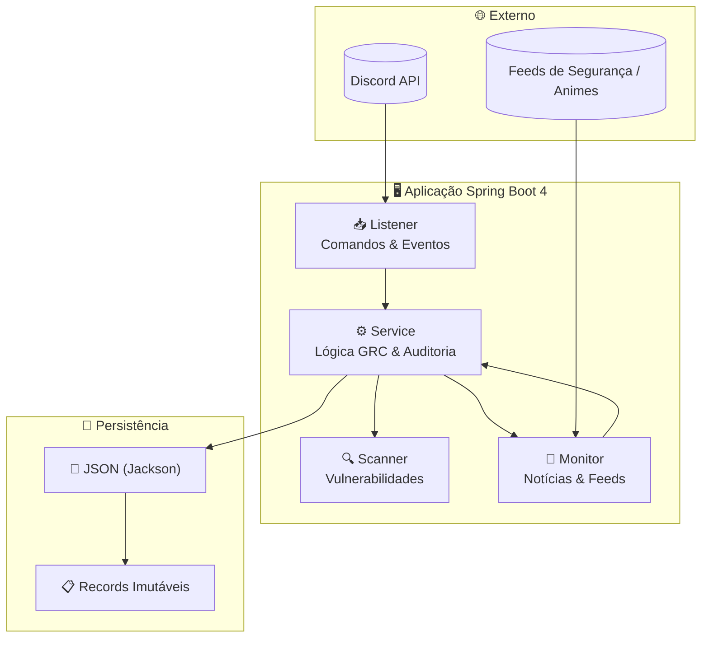

<div align="center">


# 🛡️ CyberSecurity & GRC Bot (Java 25 Edition)

**Bot multifuncional para Discord** focado em **Cybersecurity (GRC)**, monitoramento de vulnerabilidades e automação de notícias (Animes/Gundam).  
Migrado de Python para **Java 25** para atingir padrões corporativos de resiliência e segurança.

[](https://openjdk.org/)
[](https://spring.io/projects/spring-boot)
[](https://gradle.org/)
[](https://www.docker.com/)
[](https://discord.com/)
[](docs/TESTES-MANUAL-E-INTEGRACAO.md)
[](LICENSE)

</div>

---

## 📑 Índice

- [Visão geral](#-visão-geral)
- [Diagrama de arquitetura](#-diagrama-de-arquitetura)
- [Tabela de comandos do bot](#-tabela-de-comandos-do-bot)
- [Motivação da migração (Python → Java 25)](#-motivação-da-migração-python--java-25)
- [Tecnologias](#-tecnologias)
- [Estrutura do projeto](#-estrutura-do-projeto)
- [Como executar](#-como-executar)
- [Auditoria e GRC](#-auditoria-e-grc)
- [Documentação completa](#-documentação-completa)

---

## 🎯 Visão geral

O **CyberIntel - NetRunner** é um bot para Discord que:

- **Varre 15 fontes de inteligência** (CISA KEV, Ransomware.live, RSS) em paralelo
- **Persiste alertas** em `data/vulnerabilidades.json` de forma **idempotente** e **thread-safe**
- **Notifica** no canal configurado (alertas críticos/altos)
- Oferece comandos de **auditoria GRC**, **CVE**, **scan de URL** e **painel admin** (honeypot)

---

## 📐 Diagrama de arquitetura



Mais diagramas e fluxos: [docs/ARQUITETURA.md](docs/ARQUITETURA.md).

---

## 📋 Tabela de comandos do bot

| Comando | Descrição | Permissão |
|---------|-----------|------------|
| `/ping` | Latência do bot | Qualquer usuário |
| `/about` | Informações do bot e stack | Qualquer usuário |
| `/dashboard` | Link do SOC Dashboard (Node-RED) | Qualquer usuário |
| `/feeds` | Lista as 15 fontes de inteligência ativas | Qualquer usuário |
| `/status` | Uptime e status das APIs | Qualquer usuário |
| `/force_scan` | Varredura manual nas fontes | **Administrador** |
| `/cve` \<cve_id\> | Consulta CVE no NIST NVD | Qualquer usuário |
| `/scan` \<url\> | Análise de URL (URLScan/VirusTotal) | Qualquer usuário |
| `/check` | Auditoria de vulnerabilidades GRC | Qualquer usuário |
| `/add` | Registra nova vulnerabilidade | **Administrador** |
| `/delete` \<id\> | Remove vulnerabilidade (em implementação) | — |
| `/set_channel` | Fixa canal operacional | **Administrador** |
| `/admin_panel` | Painel administrativo (honeypot) | **Owner** |

➡️ **Tabela completa** com parâmetros e respostas: [docs/COMANDOS.md](docs/COMANDOS.md).

---

## 🚀 Motivação da migração (Python → Java 25)

| Motivação | Descrição |
|-----------|-----------|
| **⚡ Performance e escalabilidade** | **Project Loom (Virtual Threads)** no Java 25 para processamento paralelo com baixo overhead. |
| **🛡️ Segurança de tipo** | Tipagem estática e forte para reduzir falhas em tempo de execução. |
| **📦 Arquitetura enxuta** | **Java Records** para imutabilidade, sem Lombok nem DTOs desnecessários. |
| **🏗️ Enterprise ready** | Spring Boot 4.0.3 e suporte a **Docker Compose** para orquestração de containers. |

---

## 🛠️ Tecnologias

| Stack | Tecnologia |
|-------|------------|
| **Linguagem** | Java 25 (LTS) |
| **Framework** | Spring Boot 4.0.3 |
| **Build** | Gradle (Kotlin DSL) |
| **Discord** | JDA (Java Discord API) |
| **Persistência** | JSON via Jackson (YAGNI) |
| **Containerização** | Docker & Jib |

---

## 📂 Estrutura do projeto

```
src/main/java/br/com/bot/cyberseguranca/
├── config/       # DiscordConfig, RestTemplate, JDA
├── listener/     # CommandListener (Slash Commands)
├── model/        # Records: AlertaSeguranca, ConfigSources, RssSource...
├── service/      # VulnerabilityService, ThreatIntelligenceService, BotConfigService
└── exception/    # PersistenceException, BotBaseException...
```

---

## 🐳 Como executar

1. **Clone o repositório**
   ```bash
   git clone https://github.com/carmipa/projeto-cyberseguranca-bot-java.git
   cd projeto-cyberseguranca-bot-java
   ```

2. **Configure** `DISCORD_TOKEN` e `DISCORD_CHANNEL_ID` (e opcionalmente `discord.owner.id`) no `.env` ou em `application.properties`.

3. **Build e run**
   ```bash
   ./gradlew bootRun
   ```

4. **Testes**
   ```bash
   ./gradlew test
   ```

Guia detalhado: [docs/INSTALACAO-E-CONFIGURACAO.md](docs/INSTALACAO-E-CONFIGURACAO.md).

---

## 📝 Auditoria e GRC

O bot inclui:

- **🔍 Scanner** de vulnerabilidades (CISA KEV, Ransomware.live, RSS)
- **📊 Persistência** em `vulnerabilidades.json` (idempotente e thread-safe)
- **📰 Monitoramento** de feeds de segurança (e Animes/Gundam via `sources.json`)
- **🔐 Honeypot** `/admin_panel` com log de tentativas não autorizadas

---

## 📚 Documentação completa

| Documento | Conteúdo |
|-----------|----------|
| [**COMANDOS.md**](docs/COMANDOS.md) | Tabela completa de comandos, parâmetros e permissões |
| [**ARQUITETURA.md**](docs/ARQUITETURA.md) | Diagramas Mermaid, fluxos e estrutura de pacotes |
| [**INSTALACAO-E-CONFIGURACAO.md**](docs/INSTALACAO-E-CONFIGURACAO.md) | Variáveis de ambiente, Docker, Jib e pastas `data/` |
| [**TESTES-MANUAL-E-INTEGRACAO.md**](docs/TESTES-MANUAL-E-INTEGRACAO.md) | Checklist de testes manuais e integração |

---

<div align="center">

**Desenvolvido por [Carminati](https://github.com/carmipa)** — Analista de Sistemas & Cybersecurity (GRC)

</div>
