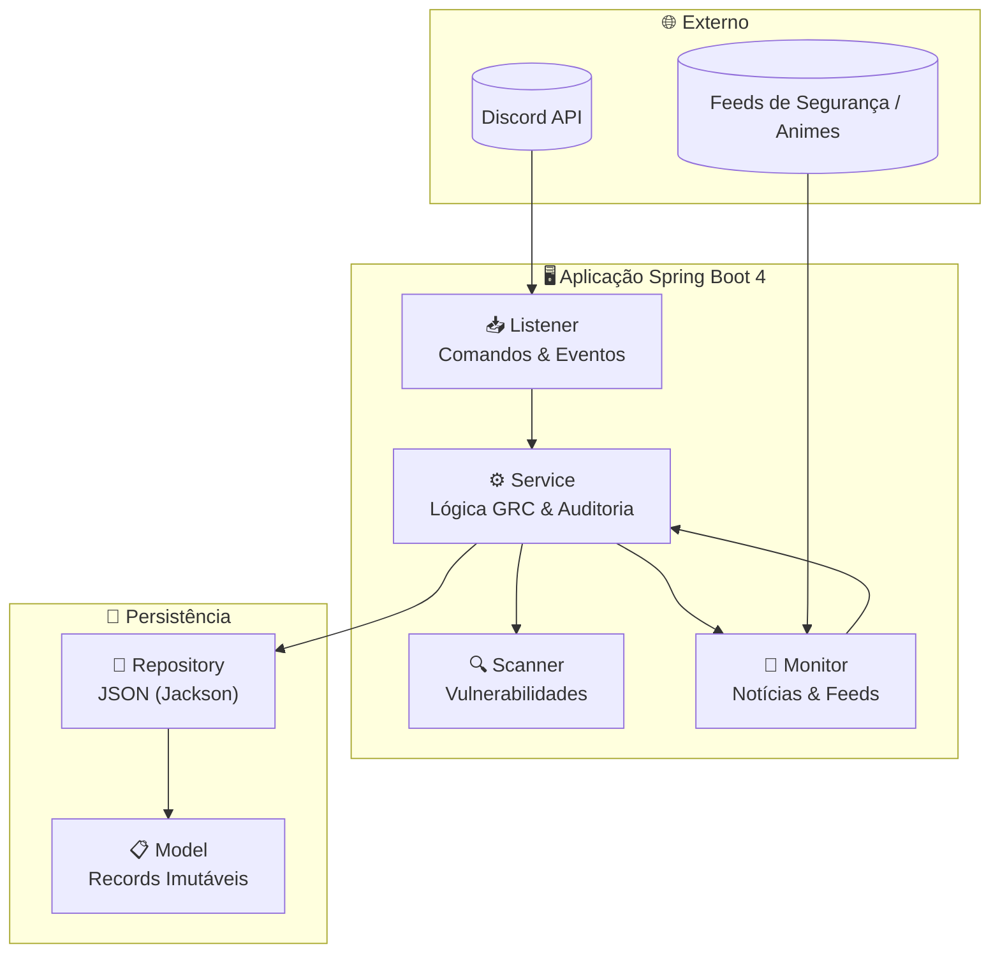

<div align="center">


# 🛡️ CyberSecurity & GRC Bot (Java 25 Edition)

[](https://openjdk.org/)
[](https://spring.io/projects/spring-boot)
[](https://gradle.org/)
[](https://www.docker.com/)
[](https://discord.com/)

**Bot multifuncional (Discord) focado em Cybersecurity (GRC), monitoramento de vulnerabilidades e automação de notícias (Animes/Gundam)**  
Migrado de Python para Java 25 para atingir padrões corporativos de resiliência e segurança.

</div>

---

## 📐 Diagrama de Arquitetura



---

## 🚀 Motivação da Migração (Python ➔ Java 25)

A transição para o ecossistema Java foi motivada pela necessidade de uma arquitetura mais robusta e auditável, essencial para o setor de Cyber Defense:

| Motivação | Descrição |
|-----------|-----------|
| **⚡ Performance & Escalabilidade** | Implementação do **Project Loom (Virtual Threads)** no Java 25, permitindo processamento paralelo massivo com baixo overhead de CPU. |
| **🛡️ Segurança de Tipo** | Tipagem estática e forte para reduzir vulnerabilidades em tempo de execução e garantir a integridade do fluxo de dados. |
| **📦 Arquitetura Slim** | Uso de **Java Records** nativos para imutabilidade de dados, eliminando a dependência de bibliotecas como Lombok e camadas desnecessárias de DTOs. |
| **🏗️ Enterprise Ready** | Integração com **Spring Boot 4.0.3** e suporte nativo ao **Docker Compose** para orquestração ágil de containers. |

---

## 🛠️ Tecnologias Utilizadas

| Stack | Tecnologia |
|-------|------------|
| **Linguagem** | Java 25 (LTS) |
| **Framework** | Spring Boot 4.0.3 |
| **Build** | Gradle (Kotlin DSL) |
| **Discord API** | JDA (Java Discord API) |
| **Persistência** | JSON via Jackson (Persistência Raiz / YAGNI) |
| **Containerização** | Docker & Jib |

---

## 📂 Estrutura do Projeto

O projeto segue os princípios de **Clean Code Pragmático**, priorizando legibilidade e facilidade de auditoria:

```
src/main/java/br/com/bot/cyberseguranca/
├── model/          # Definição de Records imutáveis
├── service/        # Lógica de negócio, GRC e auditoria
├── repository/     # Manipulação direta de persistência JSON
└── listener/       # Interceptação e tratamento de comandos do Discord
```

---

## 🐳 Como Executar (Docker)

Certifique-se de ter o **Docker** instalado no seu ambiente.

### 1. Clone o repositório

```bash
git clone https://github.com/carmipa/projeto-cyberseguranca-bot-java.git
cd projeto-cyberseguranca-bot-java
```

### 2. Configure o Token

Adicione o seu `DISCORD_TOKEN` nas variáveis de ambiente ou no arquivo `application.properties`.

### 3. Build & Run

Utilizando o suporte nativo ao Docker Compose do Spring Boot 4:

```bash
./gradlew bootRun
```

---

## 📝 Auditoria e GRC

O bot inclui módulos para:

- **🔍 Scanner** de vulnerabilidades básicas em arquivos de configuração
- **📊 Relatórios** de conformidade baseados em normas de segurança
- **📰 Monitoramento** de feeds de segurança (Cyber e Animes/Gundam)

---

<div align="center">

**Desenvolvido por [Carminati](https://github.com/carmipa)** — Analista de Sistemas & Cybersecurity (GRC)

</div>
