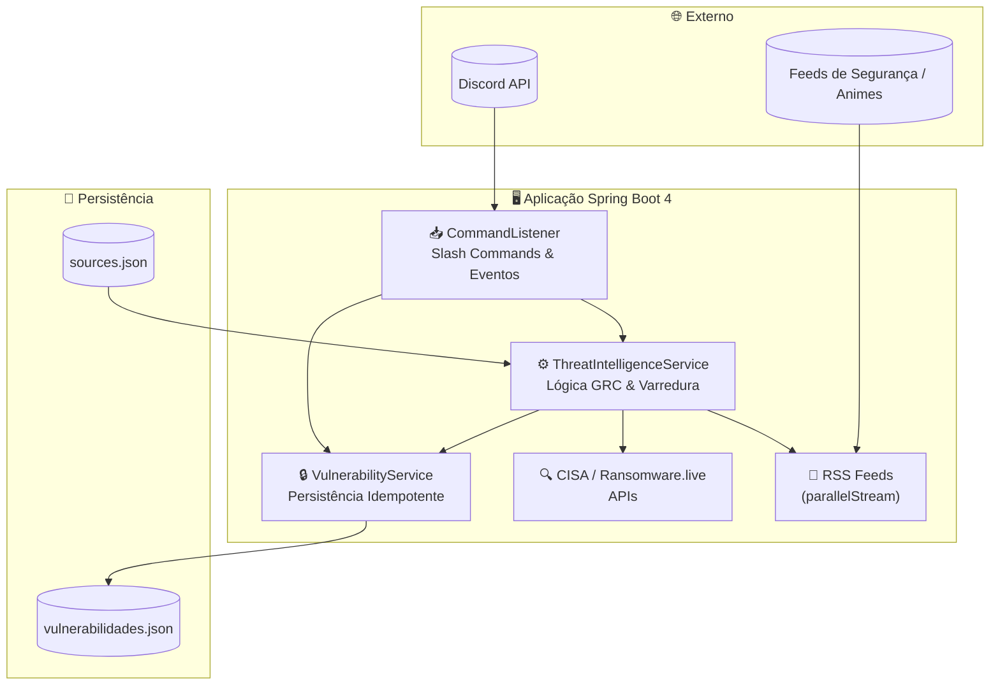
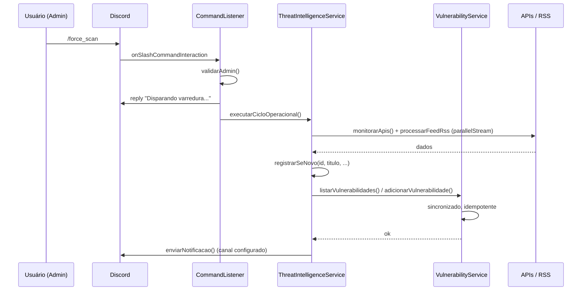
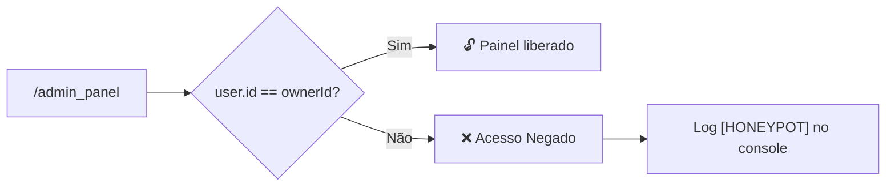
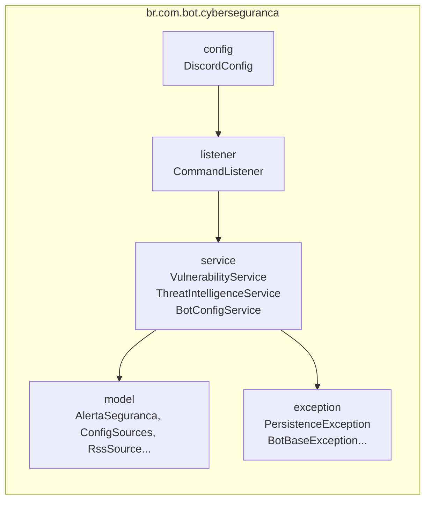

# 📐 Arquitetura do CyberSecurity & GRC Bot

Documentação da arquitetura do bot, fluxos de dados e diagramas para exibição no GitHub.

---

## 🏗️ Visão geral

O bot é uma aplicação **Spring Boot 4** que consome a **Discord API** via **JDA**, executa varreduras em fontes de inteligência (CISA, Ransomware.live, RSS) e persiste alertas em **JSON** (YAGNI). O processamento paralelo usa **parallelStream()** nas 15 fontes, com persistência **idempotente** e **thread-safe**.

---

## 📐 Diagrama de arquitetura de alto nível

---

## 🔄 Fluxo do comando `/force_scan`

---

## 🔐 Fluxo do Honeypot (`/admin_panel`)

O `ownerId` é configurado via `discord.owner.id` (env ou `application.properties`). Qualquer outra conta recebe "Acesso Negado" e a tentativa é registrada no stderr para auditoria.

---

## 📂 Estrutura de pacotes (Java)

---

## 🛠️ Stack técnica resumida

| Camada | Tecnologia |
|--------|------------|
| **Linguagem** | Java 25 (LTS) |
| **Framework** | Spring Boot 4.0.3 |
| **Build** | Gradle (Kotlin DSL) |
| **Discord** | JDA (Java Discord API) |
| **HTTP** | RestTemplate (timeouts 10s) |
| **Persistência** | JSON (Jackson), arquivos em `data/` |
| **RSS** | Rome (SyndFeed) |
| **Container** | Docker, Jib |

---

## 📚 Documentos relacionados

- [COMANDOS.md](COMANDOS.md) — Tabela completa de comandos do bot
- [INSTALACAO-E-CONFIGURACAO.md](INSTALACAO-E-CONFIGURACAO.md) — Setup e variáveis de ambiente
- [TESTES-MANUAL-E-INTEGRACAO.md](TESTES-MANUAL-E-INTEGRACAO.md) — Checklist de testes manuais e integração
